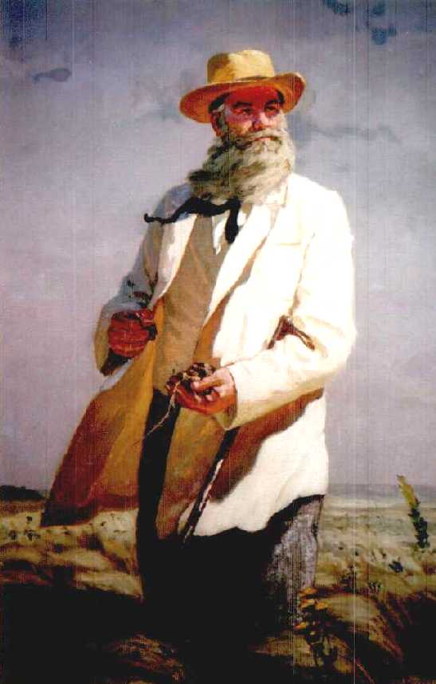
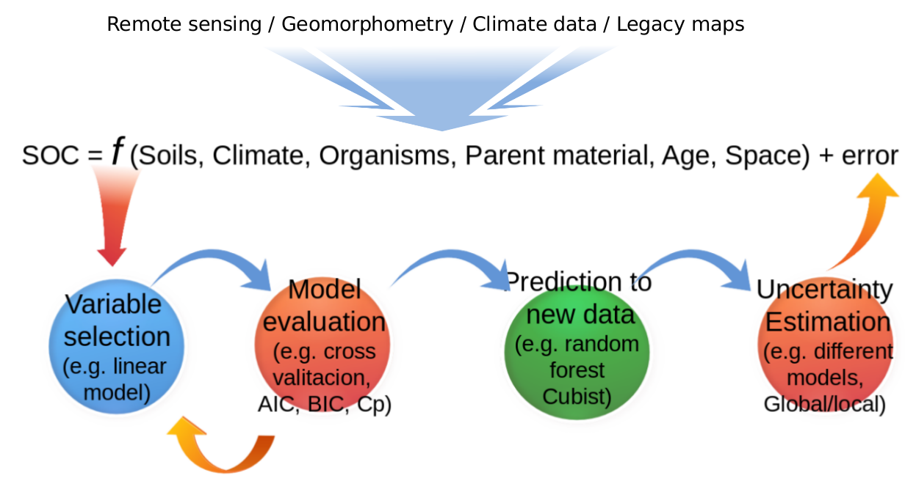

Introduction to Digital Soil Mapping using the SOC Mapping Cookbook
========================================================
author: Guillermo Federico Olmedo
date: 12th March 2018
autosize: false

DSM: definition
====================================
Digital Soil Mapping (DSM) is the creation and the population of a geographically referenced soil database, generated at a given resolution by using field and laboratory observation methods coupled with environmental data through quantitative relationships (see http://digitalsoilmapping.org/).

Digital Soil Mapping: Origin
========================================================
right: 30%

> “Soils being a result of a very complicated interaction between local climate, plant and animal organisms, content and structure of parent rocks, topography, and, finally, age of the terrain” (Dokuchaev, 1883)

$$П = f(К,О,Г)В$$

where П is the soil, and К is the climate, О are the organism and Г represents the paretn material. В representes the age factor.

***

DSM: Conceptual basis
==============================================================
right: 25%

* Dokuchaev 1883
* Jenny 1941
* Troeh 1964
* Walker 1968
* Legros and Bonneric 1979
* Moore et al 1993
* Heuvelink and Webster 2001

***

The quantitative-digital model
=======================================

$$S_a = f(s_{[x; y ~ t]},c_{[x; y ~ t]},o_{[x; y ~ t]},r_{[x; y ~ t]},p_{[x; y ~ t]},a_{[x; y ~ t]},n_{[x; y ~ t]})$$

* where $S_a$ is the soil attribute of interest at a specific location; $s$ is the soil or other soil properties; $c$ is the climate or climatic properties of the environment; $o$ are the organisms, vegetation, fauna or human activity; $r$ is topography or landscape attributes; $p$ is parent material or lithology; $a$ is the substrate age or the time factor; and $n$ represents the space or spatial location. The spatial coordinates and time ($x, y ~ t$) must be known for the seven factors.

* The left side of the equation is usually represented by the available geo-spatial soil observational data (e.g., from legacy soil profile collections) and the right side of the equation is represented by the soil prediction factors. 

*McBratney, Mendonça-Santos y Minasny, (2003) – Geoderma 117. pp 3 - 52*

The soil prediction factors
============================================

* S: Soil (maps, profiles, samples)
* C: Climate (temperature...)
* O: Landuse, NDVI, Biomass
* R: 
  - DEM + derivates
  - Aspect
  - Slope
  - Curvature
  - Topographic Wetness Index
  - Landscape/Terrain classification
* P – Litology
* A – Age
* N – Spatial position 

The functions
=========================================
* Multiple linear models
* Geostatistical models
* Decision trees
* Neural networks
* Fuzzy logic models 
* Kernel based models

Baseline datasets
========================================
* Digital terrain parameters
* Climate surfaces
* Remote sensing
* Legacy and polygon maps (i.e., soil, geology, land use/cover)
* SoilGrids250m system

*Pelletier et al. 2016, Shangguan et al., 2017, Hengl et al. 2017, Fick  and Hijmans, 2017*

Global-to-local and local-to-global SOC mapping
=========================================
* All models are wrong but some of they are useful 
* Models should not compete but inform each other
* Different models (and modeling cultures) will capture different portions of SOC
* There are no best method on digital soil mapping (no silver bullets) 
* Ensemble learning should be part of the pedometrics agenda
* The eternal question is, how inform nationwide policy decision based on the best information available?
*Box 1976, Breiman 2001,  Ho and Pepyne 2002,, Finke 2012, Qiao et al. 2015*

Digital terrain analysis (DTA) in SAGA GIS
===========================================
* Topography is a major driver of soil variability 
* Topography can be represented by digital elevation models
* We have digital elevation models globally available
* Using DTA we can derive topographic attributes (e.g. Slope, aspect, wetness index).
* Exercise 1. Derive terrain parameters in SAGA GIS using a digital elevation model of 1x1 km.

Workflow (Guevara et al, NACP, 2017)
==================================
title: no

*Guevara et al, NACP, 2017*

Workflow using the SOC Mapping Cookbook
==================================

