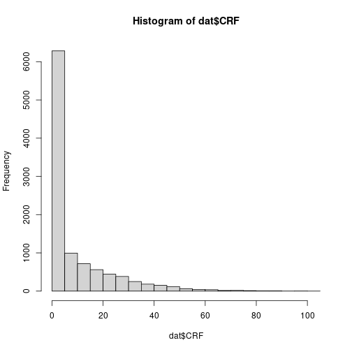

Soil Data Preparation
========================================================
author: Guillermo Federico Olmedo
date: 12th March 2018
autosize: true 

Soil Profiles and Soil Augers
========================================== 

* Soil profiles are complex real-world entities. 
* They are composed of soil layers which form soil horizons; 
* the soil layers have different properties and these properties are evaluated with different methods.  

As we know, soil and vertical soil properties are landscape elements and part of matter dynamics (water, nutrients, gases, habitat, etc.). Local soil samples or soil profiles add a third dimension into the spatial assessment of soil properties in the landscape. 

Example of soil databases (site-level data table)
=========================================


|ProfID | X_coord| Y_coord| Year|Soil_Type              |
|:------|-------:|-------:|----:|:----------------------|
|P1276  | 7591265| 4632108| 2012|Complex of Chernozem … |
|P1277  | 7592027| 4631664| 2012|Complex of Chernozem … |
|P1278  | 7592704| 4631941| 2012|Complex of Chernozem … |
|P1279  | 7590817| 4633115| 2013|Complex of Chernozem … |

Example of soil databases (profile-description table)
=========================================


|ProfID |HorID    | top| bottom|  SOC|  BLD| CRF| Sand| Silt| Clay|
|:------|:--------|---:|------:|----:|----:|---:|----:|----:|----:|
|P1276  |P1276H01 |   0|     50| 2.78| 1.05|  11|   52|   39|    9|
|P1276  |P1276H02 |  50|     76| 1.75| 1.45|   4|   56|   31|   14|
|P1276  |P1276H03 |  76|    100| 1.19| 1.22|   2|   43|   35|   22|
|P1277  |P1277H01 |   0|     28| 1.93| 1.36|   8|   59|   22|   18|
|P1277  |P1277H02 |  28|     48| 1.60| 1.43|   9|   69|   15|   16|
|P1277  |P1277H03 |  48|     63| 1.26|   NA|  25|   65|   21|   13|
|P1277  |P1277H04 |  63|    120| 0.86|   NA|  54|   63|   23|   14|
|P1278  |P1278H01 |   0|     40| 2.32| 1.27|   0|   50|   39|   12|
|P1278  |P1278H02 |  40|     68| 1.80| 1.48|   1|   46|   39|   16|
|P1278  |P1278H03 |  68|    120| 0.89| 1.18|   0|   47|   39|   14|

Loading the data
=====================================================================

```r
dat <- read.csv(file = "data/horizons.csv")

# Explore the data
str(dat)
summary(dat)
```

```
'data.frame':	10292 obs. of  10 variables:
 $ ProfID: Factor w/ 4118 levels "P0000","P0001",..: 1 1 1 2 2 3 3 3 4 5 ...
 $ HorID : Factor w/ 9914 levels "P0000H01","P0000H02",..: 1 2 3 4 5 6 7 8 9 10 ...
 $ top   : int  4 23 46 2 11 0 22 63 0 3 ...
 $ bottom: int  23 46 59 11 31 22 63 90 19 10 ...
 $ SOC   : num  NA NA NA NA NA ...
 $ BLD   : num  NA NA NA NA NA NA NA NA NA NA ...
 $ CRF   : num  54 62 47 66 70 57 77 87 8 4 ...
 $ SAND  : int  52 59 67 45 40 52 48 43 50 48 ...
 $ SILT  : num  34 31 24 39 31 33 36 42 16 35 ...
 $ CLAY  : num  14 11 8 16 28 15 16 16 34 17 ...
     ProfID           HorID            top             bottom      
 P2881  :   64   P2881H01:   64   Min.   :  0.00   Min.   :  1.00  
 P1481  :   32   P0434H02:    8   1st Qu.:  0.00   1st Qu.: 25.00  
 P2096  :   32   P1286H01:    8   Median : 20.00   Median : 45.00  
 P3623  :   32   P2056H01:    8   Mean   : 27.48   Mean   : 55.82  
 P2056  :   24   P2056H02:    8   3rd Qu.: 47.00   3rd Qu.: 80.00  
 P2142  :   24   P2056H03:    8   Max.   :285.00   Max.   :295.00  
 (Other):10084   (Other) :10188                                    
      SOC              BLD            CRF             SAND       
 Min.   : 0.000   Min.   :0.00   Min.   :  0.0   Min.   :  0.00  
 1st Qu.: 1.090   1st Qu.:1.40   1st Qu.:  2.0   1st Qu.: 44.00  
 Median : 1.800   Median :1.54   Median :  8.0   Median : 58.00  
 Mean   : 2.603   Mean   :1.55   Mean   : 13.5   Mean   : 57.67  
 3rd Qu.: 2.940   3rd Qu.:1.66   3rd Qu.: 21.0   3rd Qu.: 72.00  
 Max.   :83.820   Max.   :2.93   Max.   :104.0   Max.   :100.00  
 NA's   :831      NA's   :7845   NA's   :3360    NA's   :1049    
      SILT            CLAY      
 Min.   : 0.00   Min.   : 0.00  
 1st Qu.:16.00   1st Qu.: 7.00  
 Median :24.00   Median :14.00  
 Mean   :25.64   Mean   :17.08  
 3rd Qu.:33.00   3rd Qu.:24.00  
 Max.   :80.00   Max.   :83.00  
 NA's   :920     NA's   :927    
```


```r
dat_sites <- read.csv(file = "data/site-level.csv")

# Explore the data
str(dat_sites)
```

```
'data.frame':	4118 obs. of  6 variables:
 $ X.1       : int  1 2 3 4 5 6 7 8 9 10 ...
 $ ProfID    : Factor w/ 4118 levels "P0000","P0001",..: 1 2 3 4 5 6 7 8 9 10 ...
 $ soiltype  : Factor w/ 58 levels "Albic Luvisol",..: 3 3 3 57 57 40 40 31 31 12 ...
 $ Land.Cover: int  25 24 25 26 26 27 27 27 22 23 ...
 $ X         : num  20.8 20.8 20.8 20.8 20.8 ...
 $ Y         : num  42 42 42 42 42 ...
```

Coarse Fragments
==========================================

```r
# summary of column CRF (Coarse Fragments) in the example data base
summary(dat$CRF)
```

```
   Min. 1st Qu.  Median    Mean 3rd Qu.    Max.    NA's 
    0.0     2.0     8.0    13.5    21.0   104.0    3360 
```

```r
# Convert NA's to 0
dat$CRF[is.na(dat$CRF)] <- 0

hist(dat$CRF, col = "light gray")
```




Bulk density
============================================
* saini_1966
$$BD = 1.62-0.06 * OM$$ 

* Drew1973
$$BD = 1/(0.6268 + 0.0361 * OM)$$

* Jeffrey1970note
$$BD = 1.482 - 0.6786 * (log OM)$$


Bulk density
============================================
* Grigal1989
$$BD = 0.669 + 0.941 * e^{(-0,06 * OM)}$$

* adams1973effect
$$BD = 100/(OM/0.244 + (100-OM))/MBD$$

* honeysett1989use
$$BD = 1/(0.564 + 0.0556*OM)$$

Creating a pedo transfer function in R for Bulk density
==================================================================

```r
# Creating a function in R to estimate BLD using the SOC
# SOC is the soil organic carbon content in \%
estimateBD <- function(SOC, method="Saini1996"){
  OM <- SOC * 1.724
  if(method=="Saini1996"){BD <- 1.62 - 0.06 * OM}
  if(method=="Drew1973"){BD <- 1 / (0.6268 + 0.0361 * OM)}
  if(method=="Jeffrey1979"){BD <- 1.482 - 0.6786 * (log(OM))}
  if(method=="Grigal1989"){BD <- 0.669 + 0.941 * exp(1)^(-0.06 * OM)}
  if(method=="Adams1973"){BD <- 100 / (OM /0.244 + (100 - OM)/2.65)}
  if(method=="Honeyset_Ratkowsky1989"){BD <- 1/(0.564 + 0.0556 * OM)}
  return(BD)
}
```

